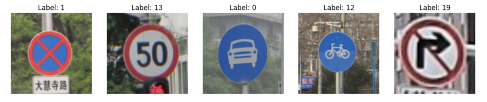
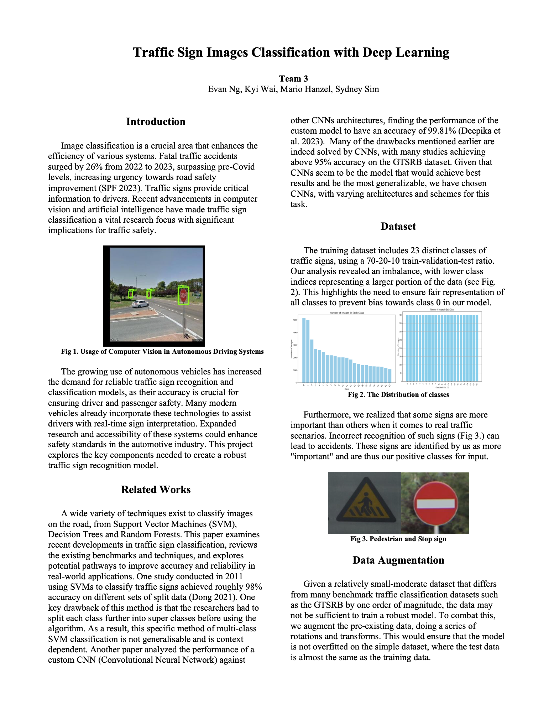
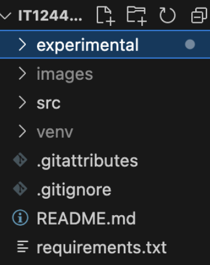
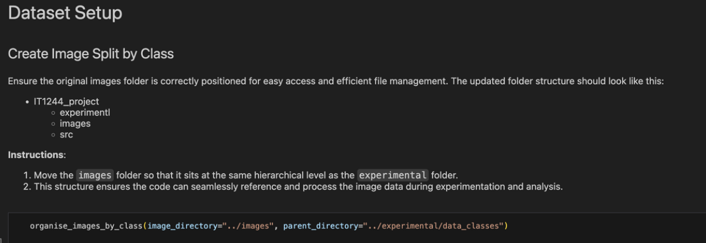
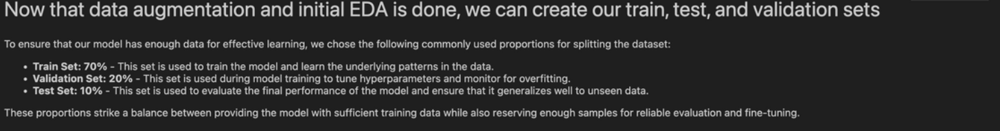
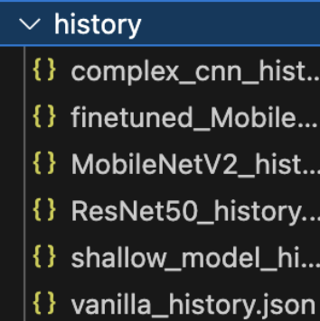
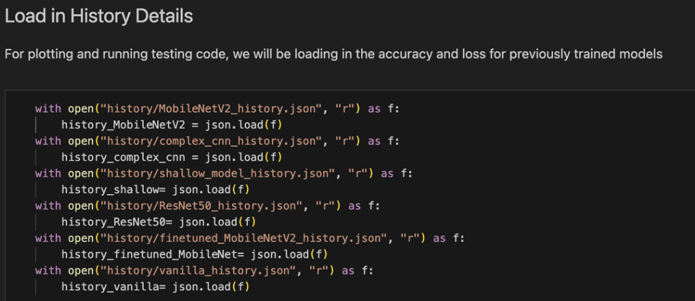
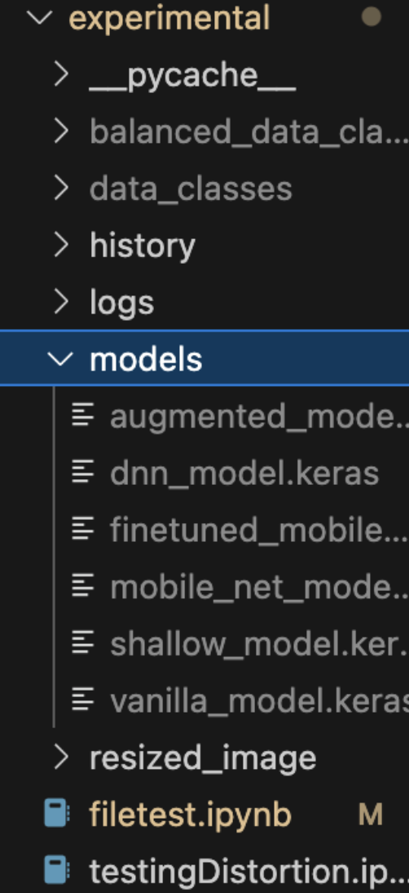

# Traffic Sign Classifier Using Neural Networks

### By: Evan Ng, Kyi Wai, Mario Hanzel, Sydney Sim



---
## Project Report available under Team 3 Project Report.pdf, Please read!!!



## Instructions

1. **Install Requirements**
   - Use the following command to install all necessary dependencies from `requirements.txt`:
     ```bash
     pip install -r requirements.txt
     ```

2. **Download Models**
   - Download the pre-trained models and image Dataset from the provided Google Drive link:
     [Google Drive - Models and Image Dataset](https://drive.google.com/drive/folders/1zAgRTRNzlkOubOKzDlF99UdJUOqatqKq?usp=sharing)

3. **Dataset Setup**
   - Ensure the images dataset is placed in the parent directory. The folder structure should look like this:

   

4. **Running the Notebook**
   - **Step 1**: Run **ALL** cells in the `Dataset Setup` and `Train-Test Split` sections.

   

   

   - **Step 2**: In the `Model Training and Evaluation` sections, **skip** cells marked as `[Model Training]`. Example:

   

5. **Accessing Training History**
   - All training history plots and data are saved in the `history` folder. Ensure this folder is initialized when running the notebook.

   

6. **Model Storage**
   - Keep all models in a folder named `models` and place this folder inside the `experimental` directory.

   
---

**THANK YOU!**
